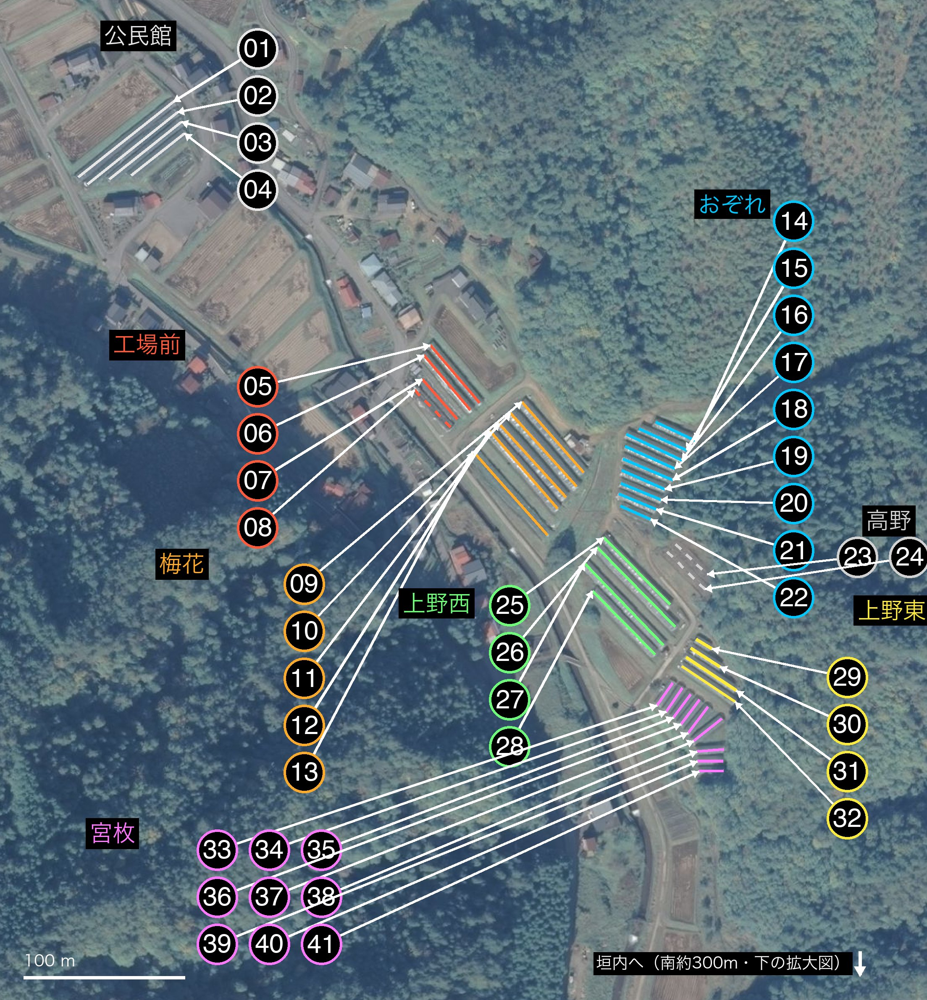
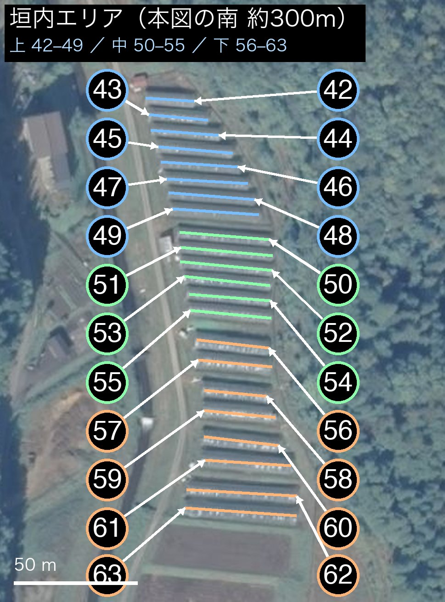

# 桐谷農場 ハウス座標マップ（01–63）

## 北側エリア（01–41）

## 垣内エリア（42–63・北側マップの南 約300m）

---

**号数01–63は北から南への通し採番・2桁表記（2026-07-19確定）。** 未設置3箇所（08・23・24）にも番号を確保。
棟の位置・両端座標は農場主が航空写真上に作図したライン（精度±2m、WGS84）。
機械可読版は [house-map.geojson](house-map.geojson)、地図は [house-map-coordinates.jpg](house-map-coordinates.jpg)。

| 号数 | エリア | 状態 | 中心緯度 | 中心経度 | 長さ(m) | 端1(緯度,経度) | 端2(緯度,経度) | 旧号数 |
|---|---|---|---|---|---|---|---|---|
| 01 | 公民館 | 稼働 | 36.231676 | 137.224768 | 75 | 36.231885, 137.225097 | 36.231467, 137.224440 | 036 |
| 02 | 公民館 | 稼働 | 36.231627 | 137.224814 | 71 | 36.231826, 137.225124 | 36.231427, 137.224505 | 037 |
| 03 | 公民館 | 稼働 | 36.231614 | 137.224903 | 57 | 36.231773, 137.225152 | 36.231456, 137.224654 | 038 |
| 04 | 公民館 | 稼働 | 36.231592 | 137.224990 | 42 | 36.231709, 137.225174 | 36.231475, 137.224805 | 039 |
| 05 | 工場前 | 稼働 | 36.230372 | 137.227040 | 47 | 36.230532, 137.226870 | 36.230211, 137.227211 | 001 |
| 06 | 工場前 | 稼働 | 36.230322 | 137.226987 | 44 | 36.230475, 137.226828 | 36.230170, 137.227146 | 002 |
| 07 | 工場前 | 稼働 | 36.230230 | 137.226936 | 33 | 36.230342, 137.226817 | 36.230119, 137.227055 | 003 |
| 08 | 工場前 | 未設置 | 36.230178 | 137.226887 | 32 | 36.230281, 137.226763 | 36.230074, 137.227011 | (新規・旧004枠?) |
| 09 | 梅花 | 稼働 | 36.230019 | 137.227716 | 58 | 36.230215, 137.227503 | 36.229823, 137.227929 | 005 |
| 10 | 梅花 | 稼働 | 36.229947 | 137.227653 | 61 | 36.230151, 137.227425 | 36.229744, 137.227881 | 006 |
| 11 | 梅花 | 稼働 | 36.229891 | 137.227575 | 62 | 36.230097, 137.227344 | 36.229685, 137.227806 | 007 |
| 12 | 梅花 | 稼働 | 36.229838 | 137.227515 | 64 | 36.230054, 137.227281 | 36.229622, 137.227749 | 008 |
| 13 | 梅花 | 稼働 | 36.229706 | 137.227423 | 69 | 36.229939, 137.227166 | 36.229474, 137.227680 | 009 |
| 14 | おぞれ | 稼働 | 36.230052 | 137.228562 | 27 | 36.230102, 137.228427 | 36.230001, 137.228698 | 010 |
| 15 | おぞれ | 稼働 | 36.230006 | 137.228476 | 32 | 36.230065, 137.228313 | 36.229947, 137.228639 | 011 |
| 16 | おぞれ | 稼働 | 36.229963 | 137.228417 | 38 | 36.230036, 137.228226 | 36.229891, 137.228608 | 012 |
| 17 | おぞれ | 稼働 | 36.229906 | 137.228386 | 34 | 36.229968, 137.228216 | 36.229843, 137.228557 | 013 |
| 18 | おぞれ | 稼働 | 36.229839 | 137.228373 | 34 | 36.229897, 137.228201 | 36.229780, 137.228545 | 014 |
| 19 | おぞれ | 稼働 | 36.229781 | 137.228341 | 29 | 36.229833, 137.228192 | 36.229728, 137.228490 | 015 |
| 20 | おぞれ | 稼働 | 36.229716 | 137.228325 | 27 | 36.229761, 137.228187 | 36.229671, 137.228462 | 016 |
| 21 | おぞれ | 稼働 | 36.229661 | 137.228301 | 25 | 36.229704, 137.228173 | 36.229617, 137.228430 | 017 |
| 22 | おぞれ | 稼働 | 36.229597 | 137.228289 | 20 | 36.229635, 137.228185 | 36.229560, 137.228392 | 018 |
| 23 | 高野 | 未設置 | 36.229338 | 137.228674 | 27 | 36.229422, 137.228564 | 36.229255, 137.228783 | (新規) |
| 24 | 高野 | 未設置 | 36.229276 | 137.228636 | 33 | 36.229381, 137.228506 | 36.229171, 137.228766 | (新規) |
| 25 | 上野西 | 稼働 | 36.229274 | 137.228296 | 58 | 36.229459, 137.228068 | 36.229089, 137.228525 | 019 |
| 26 | 上野西 | 稼働 | 36.229184 | 137.228290 | 69 | 36.229405, 137.228021 | 36.228963, 137.228560 | 020 |
| 27 | 上野西 | 稼働 | 36.229089 | 137.228208 | 70 | 36.229317, 137.227936 | 36.228861, 137.228479 | 021 |
| 28 | 上野西 | 稼働 | 36.228986 | 137.228206 | 55 | 36.229163, 137.227990 | 36.228809, 137.228422 | 022 |
| 29 | 上野東 | 稼働 | 36.228866 | 137.228762 | 12 | 36.228893, 137.228707 | 36.228839, 137.228817 | 023 |
| 30 | 上野東 | 稼働 | 36.228793 | 137.228770 | 22 | 36.228845, 137.228669 | 36.228740, 137.228871 | 024 |
| 31 | 上野東 | 稼働 | 36.228700 | 137.228812 | 37 | 36.228792, 137.228638 | 36.228608, 137.228986 | 025 |
| 32 | 上野東 | 稼働 | 36.228644 | 137.228792 | 40 | 36.228744, 137.228608 | 36.228545, 137.228976 | 026 |
| 33 | 宮枚 | 稼働 | 36.228588 | 137.228490 | 17 | 36.228527, 137.228436 | 36.228650, 137.228544 | 027 |
| 34 | 宮枚 | 稼働 | 36.228557 | 137.228555 | 18 | 36.228491, 137.228500 | 36.228622, 137.228610 | 028 |
| 35 | 宮枚 | 稼働 | 36.228523 | 137.228609 | 18 | 36.228458, 137.228549 | 36.228588, 137.228669 | 029 |
| 36 | 宮枚 | 稼働 | 36.228489 | 137.228666 | 19 | 36.228421, 137.228601 | 36.228556, 137.228730 | 030 |
| 37 | 宮枚 | 稼働 | 36.228445 | 137.228719 | 20 | 36.228371, 137.228650 | 36.228518, 137.228787 | 031 |
| 38 | 宮枚 | 稼働 | 36.228390 | 137.228787 | 22 | 36.228328, 137.228690 | 36.228452, 137.228884 | 032 |
| 39 | 宮枚 | 稼働 | 36.228275 | 137.228805 | 17 | 36.228270, 137.228711 | 36.228280, 137.228898 | 033 |
| 40 | 宮枚 | 稼働 | 36.228216 | 137.228803 | 16 | 36.228216, 137.228715 | 36.228216, 137.228892 | 034 |
| 41 | 宮枚 | 稼働 | 36.228160 | 137.228811 | 15 | 36.228159, 137.228727 | 36.228161, 137.228894 | 035 |
| 42 | 垣内上 | 稼働 | 36.225601 | 137.228961 | 20 | 36.225606, 137.228852 | 36.225595, 137.229070 | 040 |
| 43 | 垣内上 | 稼働 | 36.225537 | 137.228997 | 24 | 36.225547, 137.228865 | 36.225527, 137.229130 | 041 |
| 44 | 垣内上 | 稼働 | 36.225481 | 137.229027 | 27 | 36.225490, 137.228875 | 36.225471, 137.229179 | 042 |
| 45 | 垣内上 | 稼働 | 36.225418 | 137.229075 | 30 | 36.225430, 137.228907 | 36.225407, 137.229242 | 043 |
| 46 | 垣内上 | 稼働 | 36.225365 | 137.229093 | 31 | 36.225375, 137.228921 | 36.225356, 137.229266 | 044 |
| 47 | 垣内上 | 稼働 | 36.225306 | 137.229127 | 33 | 36.225314, 137.228945 | 36.225297, 137.229309 | 045 |
| 48 | 垣内上 | 稼働 | 36.225252 | 137.229148 | 35 | 36.225264, 137.228956 | 36.225239, 137.229340 | 046 |
| 49 | 垣内上 | 稼働 | 36.225194 | 137.229165 | 35 | 36.225205, 137.228971 | 36.225183, 137.229360 | 047 |
| 50 | 垣内中 | 稼働 | 36.225107 | 137.229206 | 36 | 36.225120, 137.229004 | 36.225094, 137.229407 | 048 |
| 51 | 垣内中 | 稼働 | 36.225050 | 137.229215 | 37 | 36.225066, 137.229009 | 36.225035, 137.229422 | 049 |
| 52 | 垣内中 | 稼働 | 36.224998 | 137.229212 | 37 | 36.225013, 137.229006 | 36.224982, 137.229419 | 050 |
| 53 | 垣内中 | 稼働 | 36.224944 | 137.229218 | 35 | 36.224960, 137.229025 | 36.224928, 137.229410 | 051 |
| 54 | 垣内中 | 稼働 | 36.224884 | 137.229229 | 33 | 36.224895, 137.229048 | 36.224873, 137.229411 | 052 |
| 55 | 垣内中 | 稼働 | 36.224823 | 137.229234 | 33 | 36.224837, 137.229053 | 36.224809, 137.229416 | 053 |
| 56 | 垣内下 | 稼働 | 36.224716 | 137.229242 | 29 | 36.224731, 137.229080 | 36.224700, 137.229404 | 054 |
| 57 | 垣内下 | 稼働 | 36.224644 | 137.229254 | 30 | 36.224657, 137.229087 | 36.224632, 137.229420 | 055 |
| 58 | 垣内下 | 稼働 | 36.224536 | 137.229255 | 25 | 36.224547, 137.229117 | 36.224526, 137.229394 | 056 |
| 59 | 垣内下 | 稼働 | 36.224462 | 137.229274 | 29 | 36.224474, 137.229115 | 36.224450, 137.229433 | 057 |
| 60 | 垣内下 | 稼働 | 36.224364 | 137.229281 | 30 | 36.224380, 137.229114 | 36.224348, 137.229448 | 058 |
| 61 | 垣内下 | 稼働 | 36.224285 | 137.229310 | 35 | 36.224295, 137.229118 | 36.224275, 137.229503 | 059 |
| 62 | 垣内下 | 稼働 | 36.224177 | 137.229283 | 44 | 36.224189, 137.229036 | 36.224165, 137.229530 | 060 |
| 63 | 垣内下 | 稼働 | 36.224108 | 137.229279 | 45 | 36.224122, 137.229030 | 36.224093, 137.229528 | 061 |

## エリア別サマリー

| エリア | 号数 | 稼働 | 未設置 | 中心緯度 | 中心経度 |
|---|---|---|---|---|---|
| 公民館 | 01–04 | 4 | 0 | 36.231627 | 137.224869 |
| 工場前 | 05–08 | 3 | 1 | 36.230275 | 137.226963 |
| 梅花 | 09–13 | 5 | 0 | 36.229880 | 137.227576 |
| おぞれ | 14–22 | 9 | 0 | 36.229836 | 137.228386 |
| 高野 | 23–24 | 0 | 2 | 36.229307 | 137.228655 |
| 上野西 | 25–28 | 4 | 0 | 36.229133 | 137.228250 |
| 上野東 | 29–32 | 4 | 0 | 36.228751 | 137.228784 |
| 宮枚 | 33–41 | 9 | 0 | 36.228405 | 137.228694 |
| 垣内上 | 42–49 | 8 | 0 | 36.225394 | 137.229074 |
| 垣内中 | 50–55 | 6 | 0 | 36.224968 | 137.229219 |
| 垣内下 | 56–63 | 8 | 0 | 36.224412 | 137.229272 |

## メモ

- 号数は2桁表記（01〜63）。旧号数（2026-07-06版、001–061・004欠番）との対応は表の「旧号数」列を参照。
- 垣内の上/中/下の境界は棟間ギャップ（47↔48: 約10m、55↔56: 約12m）で確定。
- 未設置3箇所は今後の増設を考慮した番号確保（08=工場前南端、23・24=高野）。
- 面積概算は 長さ×幅6m（幅は現地実測で更新推奨）。おぞれ右/左の号数境界は未確認のまま。